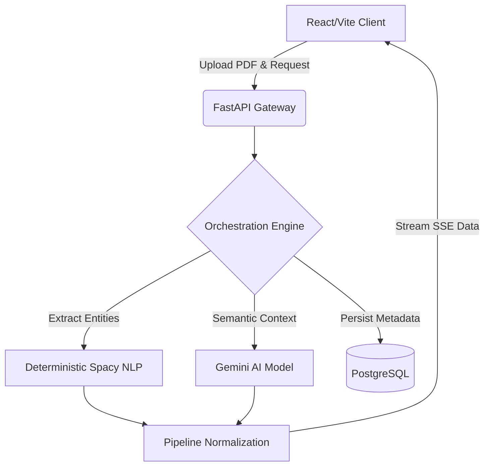

<div align="center">
  

  <h1>Pathora</h1>
  <p><b>AI-Powered Engineering Career Intelligence Platform</b></p>
  <p>
    <a href="https://carrer-intelligence.vercel.app"><b>Live Demo (Frontend)</b></a> •
    <a href="https://pathora-backend1.onrender.com/health"><b>Live API (Backend)</b></a>
  </p>

  <p>
    
    
    
    
    
  </p>
</div>

---

## ⚡ Overview

Pathora is a production-grade AI career intelligence platform built specifically for software engineers. It moves beyond generic keyword-matching ATS parsers by acting as a strict **Staff Engineer evaluator**. 

By leveraging a hybrid architecture of **Deterministic Scoring Engines** (NLP parsing, structural heuristics) and **AI Orchestration** (Gemini), Pathora deeply analyzes engineering resumes to generate actionable career roadmaps, market percentile benchmarking, and technical skill gap intelligence.

## 🏗 Architecture

Pathora operates on a modern, decoupled architecture designed for high performance and low latency.



### Tech Stack
*   **Frontend**: React, Vite, Framer Motion, Recharts, Lucide React
*   **Backend**: Python, FastAPI, Uvicorn, pdfplumber, Spacy, a2wsgi
*   **AI Integration**: Google GenAI SDK (Gemini)
*   **Database**: PostgreSQL, SQLAlchemy
*   **Infrastructure**: Vercel (Frontend), Render (Backend)

---

## 🚀 Feature Highlights

*   **Engineering Vector Mapping**: Generates a multi-dimensional radar chart evaluating candidates across Core Logic, Visual Engineering, Infrastructure, Intelligence, and System Design against market benchmarks.
*   **Recruiter Intelligence Scan**: Deterministically maps resume structures to highlight structural bottlenecks and technical penalties that would trigger recruiter rejection.
*   **Deterministic Trajectory Engine**: Maps extracted skills against a target domain dependency graph to generate a prioritized, phased learning roadmap.
*   **Real-time AI Chatbot**: An integrated SSE-streamed chatbot capable of acting as an engineering mentor to discuss resume gaps in real-time.

---

## 🧠 The Hybrid AI Intelligence Pipeline

Relying purely on LLMs for resume evaluation results in hallucinated scores and unstable data. Pathora solves this via a hybrid pipeline:

1.  **Ingestion**: `pdfplumber` synchronously extracts raw text into a heavily optimized in-memory cache.
2.  **Deterministic Evaluation**: The text is pushed through `spacy` entity extractors and proprietary heuristic scoring engines (Keyword Density, Project Complexity) to establish a mathematical baseline.
3.  **Semantic Evaluation**: The text is forwarded to Gemini with strict system prompts enforcing JSON output to evaluate abstract concepts (Engineering Maturity, Recruiter Trust).
4.  **Payload Normalization**: The backend aggregates all models into a single, flat JSON schema. The frontend translation layer dynamically maps these keys to nested component states, ensuring the UI remains robust even if the AI drops a key.

---

## 🛠 Installation & Setup

### Prerequisites
*   Node.js 18+
*   Python 3.12+
*   PostgreSQL (Optional for full DB support)
*   Google Gemini API Key

### Backend Setup (FastAPI)
```bash
cd backend
python -m venv venv
source venv/bin/activate  # Windows: venv\Scripts\activate
pip install -r requirements.txt

# Create a .env file and add:
# GEMINI_API_KEY=your_key_here
# POSTGRES_URI=your_db_uri (optional)

uvicorn app.main:app --reload
```

### Frontend Setup (React/Vite)
```bash
cd frontend
npm install

# Create a .env file and add:
# VITE_API_BASE_URL=http://127.0.0.1:8000

npm run dev
```

---

## 🌍 Deployment Architecture & Optimizations

### Frontend (Vercel)
Deployed via Vercel with aggressive static asset caching. The API client dynamically resolves between `localhost` and the Render production URL based on Vite's environment modes.

### Backend (Render Free Tier)
Deploying a complex AI orchestration pipeline on a 512MB RAM environment required aggressive dependency optimization:
*   **ML Library Pruning**: Stripped `torch`, `sentence-transformers`, and `faiss-gpu` from the environment, relying entirely on lightweight NLP (`spacy`) and external API inference to maintain a <200MB memory footprint.
*   **ASGI-to-WSGI Bridging**: To seamlessly integrate with Render's native Python web service (which defaults to Gunicorn/WSGI), we implemented `a2wsgi` to intercept the boot sequence and wrap the asynchronous FastAPI application, completely eliminating deployment startup crashes without requiring manual dashboard configuration.
*   **Synchronous Caching**: Replaced heavy Celery/Redis background task queues with an active, request-lifecycle in-memory dictionary for high-speed document text availability.

---

## 🗺 Future Scalability Roadmap

1.  **Distributed Caching**: Migrate the in-memory document store to Redis to support horizontally scaled, multi-instance Render deployments.
2.  **Persistent Vector Storage**: Reintegrate semantic embeddings (Phase 2 feature) using **pgvector** natively within PostgreSQL to maintain the lightweight footprint while enabling RAG capabilities.
3.  **Auth & Profiles**: Implement persistent JWT-based authentication bridging the existing SQLAlchemy User models with the Vercel frontend.

---
*Developed by [Bhagavan] - Building the next generation of Engineering Career Intelligence.*
